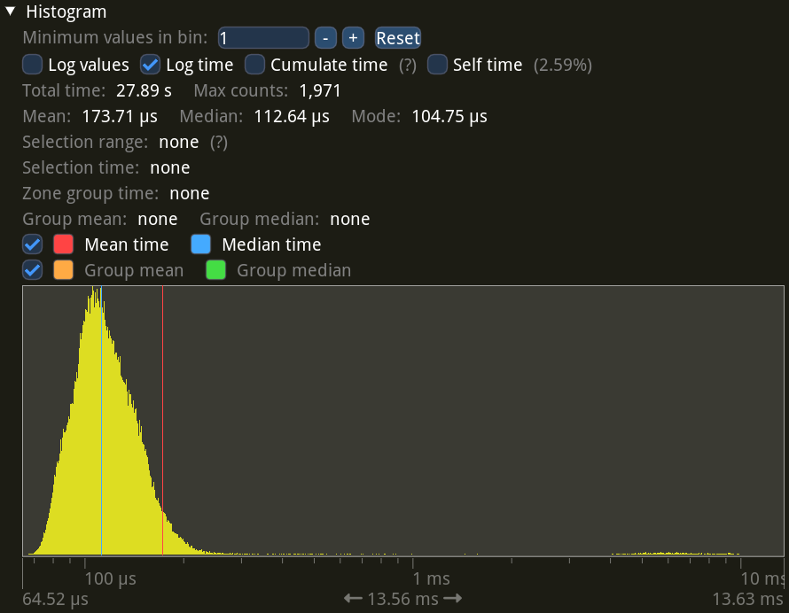
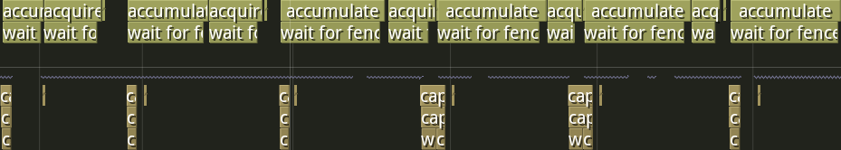


Video of a Half-Life movement map run, recorded with motion blur.


[Half-Life] is an award-winning first-person shooter from 1998.
One of the many things setting it apart is a fluid player movement system.
You can gradually build up speed in the air by turning left and right, and if you jump as soon as you hit the ground, you keep all of that speed.

These techniques, called strafing and bunny-hopping, unlocked a whole new dimension to the game, and spawned a big community of mappers and players.
There are hundreds of custom maps with challenging obstacles designed to test one's movement skills, and thousands of players competing to finish them as fast as possible.

The main hubs for these maps and records are Xtreme-Jumps[^xtreme-jumps] and [Cosy-Climbing].
They are centered around Counter-Strike 1.6, which has similar movement mechanics to Half-Life, but paced slower with a jump-speed limit and some tweaks to the acceleration.

People generally record their runs to in-game demo files.
They are very lightweight, making them easy to store and share.
Players can then capture demos to videos.
There are YouTube channels uploading videos of the best, or notable runs and edits, like [the Xtreme-Jumps channel](https://www.youtube.com/@XtremeJumps).

Since this gameplay style is focused on movement, it has been customary to use motion blur for video recordings.
When done right, it can make the video look smoother and nicer to watch; [here's such an edit](https://www.youtube.com/watch?v=FRZKSkfOjwQ) (volume warning) for example.
Though, ultimately, motion blur is a subjective preference, and plenty of people will tell you how it is completely unwatchable.
Part of this, I suspect, comes from frequent cases of motion blur done *wrong*.
I shudder at the vision of someone dropping a 60 frames-per-second (FPS) video into a 30 FPS Vegas project, and leaving frame blending on its default enabled setting.

[^xtreme-jumps]: Who unfortunately seem to have just recently lost access to their domain, https://xtreme-jumps.eu.
They're in process of rebuilding the site from scratch.

[Cosy-Climbing]: https://cosy-climbing.net
[Half-Life]: https://store.steampowered.com/app/70/HalfLife/

## How Motion Blur Works

The simplest way to get motion blur is to capture the video at a higher frame rate, then blend together multiple frames for every output video frame.
And when dealing with a closed-source game engine, there actually isn't much else you can do.
Thankfully, Half-Life demos play back smoothly at any frame rate, regardless of the FPS the player had when running[^interpolation], so this approach works perfectly.

Let's explore how several frames combine into the final frame.
The following interactive widget shows the final frame at the top, and a set of sixty consecutive sub-frames, or samples, below.
<span class="green"><strong>Green</strong></span> outlines show which of the samples are blended together to form the final frame.
Even though motion blur is best experienced in motion, this still-frame demo should make it clear how it works under the hood.

<!-- norss -->


<!-- /norss -->

There are two sliders corresponding to two of the most important parameters for controlling the motion blur.

The top one controls the video capturing FPS, usually called "samples per second", or "SPS" for short, in the context of frame blending.
A <a href="#" onclick="setLowSPS(); return false;">low SPS value</a> will produce clearly visible copies of the same objects, making it easy to tell apart the individual frames in the final composite.
A <a href="#" onclick="setHighSPS(); return false;">high SPS value</a> on the other hand will make the composite smooth and nice to look at in the final video.

The bottom slider controls the amount of blur.
It is called "exposure" because it is analogous to exposure in photography and filming.
Higher exposure means more sub-frames are blended together.
Compare <a href="#" onclick="setLowExposure(); return false;">low exposure</a> giving a mostly-clear still frame and <a href="#" onclick="setHighExposure(); return false;">high exposure</a> resulting in a lot of blur as all samples are included.

Real-world exposure lets the camera sensor take in light continuously while the shutter is open, but game video capturing is discrete and can only use the samples that were recorded.
This is why <a href="#" onclick="setLowSPS(); return false;">low SPS</a> makes individual sub-frames visible---they are the only samples we have, with no in-between contents available.

So, high SPS is *extremely important* for good motion blur.
When the player is moving or spinning fast, you need a lot of samples to blend together a smooth-looking frame without obvious edges.
This means recording the video at a very high FPS.
For Half-Life movement-oriented maps, you want to go up to at least around 3600 FPS to get a decent result regardless of what's happening on the screen.
If you can only capture the video at 60 real-time FPS, it will take you *sixty times longer* to capture the demo at 3600 FPS compared to its real-time duration.
That is, *an hour* of recording per every minute of the demo.
Basically, you really want your recording to go as fast as your computer allows, without being limited to real-time.

This problem was one of the main drivers for me to explore and make my own Half-Life video recording tools, first [hl-capture], then [bxt-rs].
Frame blending is included in the widely-used [HLAE] tool, which has been around for many years.
Unfortunately, HLAE had extremely slow recording speed back then (it is considerably better nowadays), making it unreasonable to use high FPS for motion blur.
This is why so many of the older movement videos have clearly visible frame blending artifacts.

[In the previous post](/blog/fast-half-life-video-recording-with-vulkan/#specialized-recording-tools) about bxt-rs video recording, I wrote about how these kinds of tools can capture video much faster than real-time.
Now let's see how I added motion blur to the process.

[^interpolation]: This is possible thanks to interpolation done by the Half-Life engine during demo playback.
When watching a demo, the engine looks at recorded demo frames around the current playback timestamp, and interpolates the player's position and angles, as well as other entities' positions and angles.

[hl-capture]: https://github.com/YaLTeR/hl-capture
[bxt-rs]: https://github.com/YaLTeR/bxt-rs
[HLAE]: https://www.advancedfx.org
[rotary disc shutter]: https://en.wikipedia.org/wiki/Rotary_disc_shutter

## Frame Blending in bxt-rs

Frame blending is really just per-pixel averaging of multiple frames.
If you know anything about how GPUs work, you can immediately see that this is the *perfect* task to do on a GPU: a ton of mutually-independent computations that can be done in parallel.
Better still, the input frames are *already* on the GPU: the game has just rendered them.
This means that we can avoid the costly data transfers between the GPU video memory and the main memory, making the whole process practically instantaneous. In fact, the interactive widget above is basically doing the same computation in real-time, as you're dragging the sliders.

In bxt-rs I [copy](/blog/fast-half-life-video-recording-with-vulkan/#capturing-a-frame) the frame rendered by the game into a texture [shared](/blog/fast-half-life-video-recording-with-vulkan/#sharing-memory-with-opengl) between OpenGL and Vulkan.
The Vulkan part then [converts](/blog/fast-half-life-video-recording-with-vulkan/#color-conversion) the pixel values from the RGB format to YUV 4:2:0 used in video files, downloads the result into the main memory, and [hands it over](/blog/fast-half-life-video-recording-with-vulkan/#video-encoding) to FFmpeg for video encoding.

The frame blending step will live in Vulkan, between receiving a new frame from OpenGL and pixel format conversion.
We only need to output and encode the final blended frame, so intermediate sub-frames can stay in RGB.

### Color Accumulation

We don't actually need all sixty or so sub-frames at once in video memory.
We can allocate one buffer for the output frame (the *sampling buffer*), then accumulate the intermediate frames into it one by one as they come in.
Averaging pixel values means summing them up and dividing by the total count, which is equivalent to dividing every value by the total count first, and summing them together afterwards.
Since we know the total count in advance (it's SPS multiplied by exposure), we can do this division and addition as the frames come in, and get the correct averaged result in the end.

I chose the 16-bit RGB format for the sampling buffer.
This allows up to 257 sub-frames with no precision loss due to quantization[^max-averaging-count], which is more than enough.
By default, bxt-rs records at 7200 FPS, which means up to 120 sub-frames with an output FPS of 60, or up to 240 sub-frames with an output FPS of 30---both below 257.

```rust
let create_info = vk::ImageCreateInfo {
    // Use the 16-bit RGB format in UNORM mode.
    format: vk::Format::R16G16B16A16_UNORM,
    usage:
        // For updating during the sampling stage.
        | vk::ImageUsageFlags::STORAGE
        // For clearing.
        | vk::ImageUsageFlags::TRANSFER_DST
        // For reading during YUV conversion.
        | vk::ImageUsageFlags::SAMPLED,
    // ...
};
let image_sample = device.create_image(&create_info, None)?;
```

UNORM lets me treat pixel values as floating point numbers from 0 to 1 in the shader, without having to round them manually.

The shader itself is pretty simple.
Its inputs are the new sub-frame from the game, the sampling buffer and the weight factor.
The code loads a pixel from the new sub-frame, multiplies it by the weight, and adds it into the sampling buffer.

```glsl
#version 450

// Copied from the color conversion shader where it gave the best performance.
#define WORKGROUP_SIZE 4
layout (local_size_x = WORKGROUP_SIZE, local_size_y = WORKGROUP_SIZE, local_size_z = 1) in;

// Frames coming from the game are rgba8.
layout (binding = 0, rgba8) uniform readonly image2D image_frame;
// Our intermediate buffer is rgba16.
layout (binding = 1, rgba16) uniform image2D image_sample;

// Weight is set for every frame at runtime.
layout (push_constant) uniform push_constants {
    float weight;
};

void main() {
    ivec2 size = imageSize(image_frame);
    uint width = uint(size.x), height = uint(size.y);

    uint x = gl_GlobalInvocationID.x, y = gl_GlobalInvocationID.y;
    if (x >= width || y >= height)
        return;

    ivec2 coords = ivec2(x, y);

    vec4 frameColor = imageLoad(image_frame, coords);
    vec4 sampleColor = imageLoad(image_sample, coords);

    // Accumulate the frame into the intermediate buffer.
    vec4 newColor = sampleColor + frameColor * weight;
    imageStore(image_sample, coords, newColor);
}
```

Using multiplication instead of division is just a common thing to do.
A usual justification is that it's faster this way.
I'm not sure how much this is still true, especially for shader code[^cpu-too], but anyhow.

I can use `image2D` rather than `sampler2D` for the input image, since in this shader I read every pixel independently of the rest.
This lets me avoid making the whole Vulkan combined image sampler required for a `sampler2D`.

The weight can vary between frames, so I pass it as a Vulkan push constant.
This is because exposure can cut a sub-frame in half, causing its weight to be reduced.
That might seem like an edge case which can be solved by rounding the exposure to always cover full sub-frames.
You can indeed do that for capturing demos.
However, bxt-rs also supports capturing [TAS](http://tasvideos.org/WelcomeToTASVideos.html) playback where the game's FPS cannot be changed, so the frame blending code must work with any timing thrown at it.

[^max-averaging-count]: Frames coming from the game are in 8-bit RGB format, which means the lowest color component value is .
The 16-bit RGB format expands this to represent values as low as .
When averaging together 257 color component values through accumulation, we divide every incoming value by 257.
In the worst case we end up with the resulting value of &nbsp;×&nbsp;&nbsp;=&nbsp;, which is still representable in our intermediate RGB-16 format.
Many frames will have pixel values bigger than the one-above-black , which can be divided by even higher numbers while remaining representable.

[^cpu-too]: Even if it matters only for CPU code, it is still useful, as bxt-rs implements the same operations with the same multiplication on the CPU for the fallback path.

### Recording Loop

As you may find [in the previous post](/blog/fast-half-life-video-recording-with-vulkan/#capturing-a-frame), the video recording loop without frame blending looks somewhat like this:



Every frame is copied to an intermediate buffer, because we don't know its duration until the next frame.
Then, bxt-rs converts its colors from RGB to YUV 4:2:0 on the GPU, transfers the result to the main memory, and sends it to FFmpeg for encoding.

With frame blending, the steps are a bit different:



After obtaining the frame duration, bxt-rs computes the weight and accumulates the sub-frame into the sampling buffer.
For most frames this is where the process ends.
The recorder keeps track of accumulated frame time.
As soon as we've accumulated a full output frame worth of sub-frames, it's sent through the usual steps of color conversion and FFmpeg encoding.
The sampling buffer is then cleared to zeroes, ready to accumulate for the next video frame.

There are a few edge cases to take care of.
First, as I mentioned before, the sub-frame can be covered by the exposure time only partially.
This is solved simply by reducing its accumulation weight: instead of , the weight becomes .

Then, a sub-frame may actually be split in half by an output frame boundary, and even span several output frames all by itself.
For example, this can happen when a TAS uses a long 4 FPS (0.25 ms) frame for a trick, which needs to be recorded as several output frames in a 60 FPS video.
Turns out this is also easy to handle: since we store the frame in an intermediate buffer, we can just tell the sampling code to accumulate it multiple times with different weights, while writing output frames in between.



### Synchronization

Since we store the sub-frame in an intermediate buffer, the accumulation step can run in parallel to the rendering and capturing of the next game frame.
Here, "in parallel" means both on CPU (with a second thread) and on GPU.
We therefore need to synchronize the GPU access to the intermediate buffer, so that the accumulation step won't try to read from it at the same time as the capturing step is writing to it.

For that we use the Vulkan memory barriers[^vulkan-synchronization].
The intermediate frame processing in the accumulation step starts with a transfer → shader barrier and ends with a shader → transfer barrier.

```rust
let intermediate_frame_barrier = vk::ImageMemoryBarrier::builder()
    // Make the memory write performed by a transfer available.
    .src_access_mask(vk::AccessFlags::TRANSFER_WRITE)
    // Make the memory visible for a shader read.
    .dst_access_mask(vk::AccessFlags::SHADER_READ)
    .old_layout(vk::ImageLayout::TRANSFER_DST_OPTIMAL)
    .new_layout(vk::ImageLayout::GENERAL)
    .src_queue_family_index(vk::QUEUE_FAMILY_IGNORED)
    .dst_queue_family_index(vk::QUEUE_FAMILY_IGNORED)
    .image(self.image_acquired)
    .subresource_range(vk::ImageSubresourceRange {
        aspect_mask: vk::ImageAspectFlags::COLOR,
        base_mip_level: 0,
        level_count: 1,
        base_array_layer: 0,
        layer_count: 1,
    });
self.device.cmd_pipeline_barrier(
    self.command_buffer_accumulate,
    vk::PipelineStageFlags::TRANSFER,
    vk::PipelineStageFlags::COMPUTE_SHADER,
    vk::DependencyFlags::empty(),
    &[],
    &[],
    &[*intermediate_frame_barrier],
);

// Do the processing...

let intermediate_frame_barrier = vk::ImageMemoryBarrier::builder()
    // We were not writing anything, no memory write to make available.
    .src_access_mask(vk::AccessFlags::empty())
    // Make the memory visible to a transfer write.
    .dst_access_mask(vk::AccessFlags::TRANSFER_WRITE)
    .old_layout(vk::ImageLayout::GENERAL)
    .new_layout(vk::ImageLayout::TRANSFER_DST_OPTIMAL)
    .src_queue_family_index(vk::QUEUE_FAMILY_IGNORED)
    .dst_queue_family_index(vk::QUEUE_FAMILY_IGNORED)
    .image(self.image_acquired)
    .subresource_range(vk::ImageSubresourceRange {
        aspect_mask: vk::ImageAspectFlags::COLOR,
        base_mip_level: 0,
        level_count: 1,
        base_array_layer: 0,
        layer_count: 1,
    });
self.device.cmd_pipeline_barrier(
    self.command_buffer_accumulate,
    vk::PipelineStageFlags::COMPUTE_SHADER,
    vk::PipelineStageFlags::TRANSFER,
    vk::DependencyFlags::empty(),
    &[],
    &[],
    &[*intermediate_frame_barrier],
);
```

Note that this command buffer effectively returns the intermediate frame back to the same state it was in.
This trick lets me accumulate either once or multiple times in a row without dealing with any sort of synchronization edge cases.

But wait, the intermediate frame is not the only resource used for accumulation.
What about the sampling buffer?
It has two possible paths: either it can go for color conversion, where it will be read from, or we might accumulate into it again next sub-frame.
Turns out this is not a problem: we can set the destination access mask on the closing barrier to both shader reads (if we go for color conversion) and shader writes (if we accumulate more).

```rust
// There's no opening barrier, actually,
// as the sampling buffer is already synchronized.

// Do the processing...

let sampling_buffer_barrier = vk::ImageMemoryBarrier::builder()
    // Make the accumulation shader writes available.
    .src_access_mask(vk::AccessFlags::SHADER_WRITE)
    // Make the memory visible to both shader reads and writes.
    .dst_access_mask(vk::AccessFlags::SHADER_READ | vk::AccessFlags::SHADER_WRITE)
    .old_layout(vk::ImageLayout::GENERAL)
    .new_layout(vk::ImageLayout::GENERAL)
    .src_queue_family_index(vk::QUEUE_FAMILY_IGNORED)
    .dst_queue_family_index(vk::QUEUE_FAMILY_IGNORED)
    .image(self.image_sample)
    .subresource_range(vk::ImageSubresourceRange {
        aspect_mask: vk::ImageAspectFlags::COLOR,
        base_mip_level: 0,
        level_count: 1,
        base_array_layer: 0,
        layer_count: 1,
    });
self.device.cmd_pipeline_barrier(
    self.command_buffer_accumulate,
    // This barrier will wait for the compute shader to finish.
    vk::PipelineStageFlags::COMPUTE_SHADER,
    // The next compute shader should wait for this barrier.
    vk::PipelineStageFlags::COMPUTE_SHADER,
    vk::DependencyFlags::empty(),
    &[],
    &[],
    &[*sampling_buffer_barrier],
);
```

We use two buffer, and we synchronized both of them.
We're done, right?

That's what I thought when I wrote this code, and the [validation layers] seemed to agree.
However, recording a video crashed my AMD driver a few seconds into the process.

After trying several things, re-reading the [Vulkan synchronization blog-post][vulkan-synchronization] and quadruple-checking my barriers, I was out of ideas.
I was too lazy to make a C reproducer for a Mesa bug report, so I added a fence wait, blocking the CPU until the GPU finishes the accumulation step.
This had a performance cost, but seemed to fix the issue.

```rust
// XXX: As far as I can tell, waiting for a fence here
// should not be required (and it makes the process quite
// slower). Unfortunately, I'm getting GPU fence timeouts if
// I don't do it. Maybe there's a synchronization bug in the
// code, but I don't see it, and the validation layers are
// silent too.
let create_info = vk::FenceCreateInfo::default();
let fence = self.device.create_fence(&create_info, None)?;

let command_buffers = [self.command_buffer_accumulate];
let submit_info = vk::SubmitInfo::builder().command_buffers(&command_buffers);
self.device
    .queue_submit(self.queue, &[*submit_info], fence)?;

{
    // I use tracing spans with tracing-chrome for profiling.
    let _span = info_span!("wait for fence").entered();

    // Block everything and wait until the GPU finishes the work.
    self.device
        .wait_for_fences(&[fence], true, u64::max_value())?;
}

self.device.destroy_fence(fence, None);
```

Several months passed, players were recording videos with motion blur just fine, but The Fence kept sitting in my head.
This recording code is supposed to be really fast, and I have this useless idle time right in the middle of the hottest loop.

Just look at the performance profile[^perfetto] with no Fence:


The X axis on these graphs represents time, and colored rectangles correspond to particular ranges of code that I've annotated, usually functions.
So if the rectangle is short, that means the function took little time, and the longer a rectangle is, the longer that function took.
There are two distinct rows on the graph separated with a gray line---these are the two threads: the recording thread at the top and the main game thread at the bottom.

This graph above shows four sub-frames during one of the recording sessions.
All empty space between the occasional colored area is the game's own processing.
That is, my video recording logic takes almost no time at all---less than 10% of overhead.

Now compare that to The Fence:


Ouch!
Almost all bxt-rs time is the wait, and sometimes it even eats into (and delays!) the next frame's processing.
It's helped only by the fact it happens on another thread.
Certainly in other recording scenarios this overhead will be much worse.
Hopefully you can see why this Fence had firmly leased a plot in the back of my mind.

Around that time I was testing my relatively slow ThinkPad T495s with a 4K screen.
It's got no discrete GPU and its AMD Ryzen 5 3500U CPU is an ultra-low-power model, which means lower performance.
I was occasionally getting random GPU crashes while using the desktop.
I found an [AMDGPU bug report](https://gitlab.freedesktop.org/drm/amd/-/issues/2447) about it and jumped in to help diagnose the problem.

There seemed to be several underlying issues at play, but for my laptop I found a consistent reproducer with a heavy Blender file.
The developers pinned one of the issues down to a bug in the threaded graphics driver implementation.
The workaround was to disable the threads with `GALLIUM_THREAD=0`, which for me fully fixed the Blender reproducer.

This Blender crash visually looked exactly the same as my sampling video recording crash, so naturally I decided to give it a go.
I removed The Fence, set `GALLIUM_THREAD=0`, started recording my test demo with frame blending.
It recorded fine.
Hooray, mystery solved!
It was a Mesa threading bug.
I [committed](https://github.com/YaLTeR/bxt-rs/commit/4a00b772eb9d08874775ade287baf3e9ae7670a2) the fence removal and documented the workaround in the README.

A week later an NVIDIA user reports corrupted video frames during recording.

...

Well.

Let's try with The Fence back, I guess.

No corruption.

At this point I was rather lost.
For me, the validation layers were completely silent no matter what I tried, both when my GPU worked fine and when it crashed.
I decided to give it one last chance, and asked my NVIDIA user friend to record without the fence, and with the validation layers.

```
2023-07-11T15:31:23.886949Z  INFO acquire:acquire_image: bxt_rs::vulkan: ERROR VALIDATION Validation Error: [ VUID-vkBeginCommandBuffer-commandBuffer-00049 ] Object 0: handle = 0xaded368, type = VK_OBJECT_TYPE_COMMAND_BUFFER; | MessageID = 0x84029a9f | vkBeginCommandBuffer() on active VkCommandBuffer 0xaded368[] before it has completed. You must check command buffer fence before this call. The Vulkan spec states: commandBuffer must not be in the recording or pending state (https://www.khronos.org/registry/vulkan/specs/1.3-extensions/html/vkspec.html#VUID-vkBeginCommandBuffer-commandBuffer-00049)
2023-07-11T15:31:23.887111Z  INFO acquire:acquire_image: bxt_rs::vulkan: ERROR VALIDATION Validation Error: [ VUID-vkQueueSubmit-pCommandBuffers-00071 ] Object 0: handle = 0xaed7188, type = VK_OBJECT_TYPE_DEVICE; | MessageID = 0x2e2f4d65 | vkQueueSubmit(): pSubmits[0].pCommandBuffers[0] VkCommandBuffer 0xaded368[] is already in use and is not marked for simultaneous use. The Vulkan spec states: If any element of the pCommandBuffers member of any element of pSubmits was not recorded with the VK_COMMAND_BUFFER_USAGE_SIMULTANEOUS_USE_BIT, it must not be in the pending state (https://www.khronos.org/registry/vulkan/specs/1.3-extensions/html/vkspec.html#VUID-vkQueueSubmit-pCommandBuffers-00071)
2023-07-11T15:31:23.888095Z  INFO accumulate:accumulate{weight=0.008333333767950535}: bxt_rs::vulkan: ERROR VALIDATION Validation Error: [ VUID-vkBeginCommandBuffer-commandBuffer-00049 ] Object 0: handle = 0xadf1188, type = VK_OBJECT_TYPE_COMMAND_BUFFER; | MessageID = 0x84029a9f | vkBeginCommandBuffer() on active VkCommandBuffer 0xadf1188[] before it has completed. You must check command buffer fence before this call. The Vulkan spec states: commandBuffer must not be in the recording or pending state (https://www.khronos.org/registry/vulkan/specs/1.3-extensions/html/vkspec.html#VUID-vkBeginCommandBuffer-commandBuffer-00049)
2023-07-11T15:31:23.888272Z  INFO accumulate:accumulate{weight=0.008333333767950535}: bxt_rs::vulkan: ERROR VALIDATION Validation Error: [ VUID-vkQueueSubmit-pCommandBuffers-00071 ] Object 0: handle = 0xaed7188, type = VK_OBJECT_TYPE_DEVICE; | MessageID = 0x2e2f4d65 | vkQueueSubmit(): pSubmits[0].pCommandBuffers[0] VkCommandBuffer 0xadf1188[] is already in use and is not marked for simultaneous use. The Vulkan spec states: If any element of the pCommandBuffers member of any element of pSubmits was not recorded with the VK_COMMAND_BUFFER_USAGE_SIMULTANEOUS_USE_BIT, it must not be in the pending state (https://www.khronos.org/registry/vulkan/specs/1.3-extensions/html/vkspec.html#VUID-vkQueueSubmit-pCommandBuffers-00071)
2023-07-11T15:31:23.912888Z  INFO acquire:acquire_image: bxt_rs::vulkan: ERROR VALIDATION Validation Error: [ VUID-vkBeginCommandBuffer-commandBuffer-00049 ] Object 0: handle = 0xaded368, type = VK_OBJECT_TYPE_COMMAND_BUFFER; | MessageID = 0x84029a9f | vkBeginCommandBuffer() on active VkCommandBuffer 0xaded368[] before it has completed. You must check command buffer fence before this call. The Vulkan spec states: commandBuffer must not be in the recording or pending state (https://www.khronos.org/registry/vulkan/specs/1.3-extensions/html/vkspec.html#VUID-vkBeginCommandBuffer-commandBuffer-00049)
2023-07-11T15:31:23.913049Z  INFO acquire:acquire_image: bxt_rs::vulkan: ERROR VALIDATION Validation Error: [ VUID-vkQueueSubmit-pCommandBuffers-00071 ] Object 0: handle = 0xaed7188, type = VK_OBJECT_TYPE_DEVICE; | MessageID = 0x2e2f4d65 | vkQueueSubmit(): pSubmits[0].pCommandBuffers[0] VkCommandBuffer 0xaded368[] is already in use and is not marked for simultaneous use. The Vulkan spec states: If any element of the pCommandBuffers member of any element of pSubmits was not recorded with the VK_COMMAND_BUFFER_USAGE_SIMULTANEOUS_USE_BIT, it must not be in the pending state (https://www.khronos.org/registry/vulkan/specs/1.3-extensions/html/vkspec.html#VUID-vkQueueSubmit-pCommandBuffers-00071)
2023-07-11T15:31:23.914085Z  INFO accumulate:accumulate{weight=0.008333333767950535}: bxt_rs::vulkan: ERROR VALIDATION Validation Error: [ VUID-vkBeginCommandBuffer-commandBuffer-00049 ] Object 0: handle = 0xadf1188, type = VK_OBJECT_TYPE_COMMAND_BUFFER; | MessageID = 0x84029a9f | vkBeginCommandBuffer() on active VkCommandBuffer 0xadf1188[] before it has completed. You must check command buffer fence before this call. The Vulkan spec states: commandBuffer must not be in the recording or pending state (https://www.khronos.org/registry/vulkan/specs/1.3-extensions/html/vkspec.html#VUID-vkBeginCommandBuffer-commandBuffer-00049)
2023-07-11T15:31:23.914266Z  INFO accumulate:accumulate{weight=0.008333333767950535}: bxt_rs::vulkan: ERROR VALIDATION Validation Error: [ VUID-vkQueueSubmit-pCommandBuffers-00071 ] Object 0: handle = 0xaed7188, type = VK_OBJECT_TYPE_DEVICE; | MessageID = 0x2e2f4d65 | vkQueueSubmit(): pSubmits[0].pCommandBuffers[0] VkCommandBuffer 0xadf1188[] is already in use and is not marked for simultaneous use. The Vulkan spec states: If any element of the pCommandBuffers member of any element of pSubmits was not recorded with the VK_COMMAND_BUFFER_USAGE_SIMULTANEOUS_USE_BIT, it must not be in the pending state (https://www.khronos.org/registry/vulkan/specs/1.3-extensions/html/vkspec.html#VUID-vkQueueSubmit-pCommandBuffers-00071)
2023-07-11T15:31:23.920305Z  INFO acquire:acquire_image: bxt_rs::vulkan: ERROR VALIDATION Validation Error: [ VUID-vkBeginCommandBuffer-commandBuffer-00049 ] Object 0: handle = 0xaded368, type = VK_OBJECT_TYPE_COMMAND_BUFFER; | MessageID = 0x84029a9f | vkBeginCommandBuffer() on active VkCommandBuffer 0xaded368[] before it has completed. You must check command buffer fence before this call. The Vulkan spec states: commandBuffer must not be in the recording or pending state (https://www.khronos.org/registry/vulkan/specs/1.3-extensions/html/vkspec.html#VUID-vkBeginCommandBuffer-commandBuffer-00049)
2023-07-11T15:31:23.920462Z  INFO acquire:acquire_image: bxt_rs::vulkan: ERROR VALIDATION Validation Error: [ VUID-vkQueueSubmit-pCommandBuffers-00071 ] Object 0: handle = 0xaed7188, type = VK_OBJECT_TYPE_DEVICE; | MessageID = 0x2e2f4d65 | vkQueueSubmit(): pSubmits[0].pCommandBuffers[0] VkCommandBuffer 0xaded368[] is already in use and is not marked for simultaneous use. The Vulkan spec states: If any element of the pCommandBuffers member of any element of pSubmits was not recorded with the VK_COMMAND_BUFFER_USAGE_SIMULTANEOUS_USE_BIT, it must not be in the pending state (https://www.khronos.org/registry/vulkan/specs/1.3-extensions/html/vkspec.html#VUID-vkQueueSubmit-pCommandBuffers-00071)
2023-07-11T15:31:23.920610Z  INFO accumulate:accumulate{weight=0.008333333767950535}: bxt_rs::vulkan: ERROR VALIDATION Validation Error: [ VUID-vkBeginCommandBuffer-commandBuffer-00049 ] Object 0: handle = 0xadf1188, type = VK_OBJECT_TYPE_COMMAND_BUFFER; | MessageID = 0x84029a9f | vkBeginCommandBuffer() on active VkCommandBuffer 0xadf1188[] before it has completed. You must check command buffer fence before this call. The Vulkan spec states: commandBuffer must not be in the recording or pending state (https://www.khronos.org/registry/vulkan/specs/1.3-extensions/html/vkspec.html#VUID-vkBeginCommandBuffer-commandBuffer-00049)
2023-07-11T15:31:23.920780Z  INFO accumulate:accumulate{weight=0.008333333767950535}: bxt_rs::vulkan: ERROR VALIDATION Validation Error: [ VUID-vkQueueSubmit-pCommandBuffers-00071 ] Object 0: handle = 0xaed7188, type = VK_OBJECT_TYPE_DEVICE; | MessageID = 0x2e2f4d65 | vkQueueSubmit(): pSubmits[0].pCommandBuffers[0] VkCommandBuffer 0xadf1188[] is already in use and is not marked for simultaneous use. The Vulkan spec states: If any element of the pCommandBuffers member of any element of pSubmits was not recorded with the VK_COMMAND_BUFFER_USAGE_SIMULTANEOUS_USE_BIT, it must not be in the pending state (https://www.khronos.org/registry/vulkan/specs/1.3-extensions/html/vkspec.html#VUID-vkQueueSubmit-pCommandBuffers-00071)
```

...oh.
The important part here is: `vkBeginCommandBuffer() on active VkCommandBuffer 0xaded368[] before it has completed`.
Without The Fence, my recording is calling accumulate so fast that the GPU shader from the last call is still running.
🤦
To make matters worse, the same apparently happens with copying the game's frame to the intermediate buffer.
The Fence avoided the issue by waiting for the shader completion right after starting it.

Well!
The [proper fix](https://github.com/YaLTeR/bxt-rs/commit/7ec7cd3e414236e0ef43eb59e66d1c7d9da99fca) was rather straightforward, and in fact pretty similar to The Fence.
We still have to wait for the GPU to finish, but we don't have to wait right *after* starting the work.
Instead, we can get a bit of parallelization back by waiting right *before* starting the next batch of work.
This gets most of the fence-less performance back while working perfectly fine on both AMD and NVIDIA.

Here's the performance graph to confirm it:


Looks almost the same as the fence-less graph above, save for the tiny pink areas where the GPU is waiting for the previous frame's command buffer.

Actually, further into the recording my GPU starts exhibiting some funny behavior where the waits gradually increase, and then reset back to nothing at an output frame boundary:


My guess here is that the GPU heats up and starts downclocking, so the shaders start taking longer to run.
And at an output frame boundary the long main memory transfer gives the GPU some breathing room to cool back down.

And on my NVIDIA user friend's setup the wait times seem straight up random:


Well, either way, the issue is fixed, and I'm parallelizing as much as possible, as confirmed by the performance measurements.

I'm still not sure why the validation layers didn't catch the bug on my system.
Maybe they weren't recent enough, so this check hadn't been added yet?
Regardless, it seems a good idea to run the validation layers on different drivers and GPU vendors before declaring the code working fine.

[^vulkan-synchronization]: I heavily recommend [this blog post][vulkan-synchronization] explaining how to use Vulkan synchronization and memory barriers.

[^perfetto]: I use [tracing](https://crates.io/crates/tracing) and [tracing-chrome](https://crates.io/crates/tracing-chrome) to generate Chrome-tracing-compatible performance traces, then view them in [Perfetto](https://ui.perfetto.dev/).

[validation layers]: https://github.com/KhronosGroup/Vulkan-ValidationLayers 
[vulkan-synchronization]: https://themaister.net/blog/2019/08/14/yet-another-blog-explaining-vulkan-synchronization/

### Overhead

Measuring overall video recording performance in Half-Life is difficult because, when the recording overhead is sufficiently low, the speed is fully dominated by how fast your computer can actually play a particular demo file.
It's especially challenging on AMD GPUs which are known to have worse performance for legacy OpenGL games such as Half-Life, compared to NVIDIA.
Like, here on my system I can look into one corner of the map and get 2000 FPS, then look into a different corner and get 200 FPS.

To get a somewhat reasonable measure of performance, I picked a specific demo (my kz_ytt_ancient TAS, same as the video at the very top of this post) and played it with and without capturing on two of my laptops.
I used a resolution of 2560×1440 with 60 output FPS, which is a fairly normal recording target for today.

For these measurements I used the [Tracy] profiler, which is a low-overhead game-oriented profiler.
It automatically shows histograms and statistics for frame times and regions, making it very convenient for performance analysis.

First, the results on my fast laptop: Lenovo Legion 7 Gen 7 AMD with a Ryzen 7 6800H CPU with an RX 6700M discrete GPU.
Here I used 7200 SPS, the bxt-rs default.
During recording, the demo is played at a fixed timestep of 7200 FPS, so to measure the recording overhead, for the non-recording run I also play the demo at 7200 FPS.

Let's start with normal demo playback with no recording.
Please note that all histograms below use *logarithmic scale* for the X axis.


These are frame time statistics: they show a histogram of how long each individual frame took to process, as well as the mean and the median, and the equivalent FPS values.

As you can see there's quite a bit of variation in frame times (note the logarithmic scale!), but the median frame time is 1.21 ms, or 828 FPS.
This is measured across 211,876 total frames.

Next, let's run the same demo while recording a video with motion blur.


The distribution looks similar, but there's a tail on the right.
This tail contains the one-in-120 frames which complete the sampling buffer and cause an output frame to be transferred to the main memory and sent to FFmpeg for encoding.
However, this happens infrequently enough, so the median frame time increased by just 0.16 ms, or 160 µs, compared to no recording.

Let's look at the overhead specifically.



These are statistics for just the bxt-rs recording code.
They correspond to extra work done on the main thread during recording on top of the normal game rendering.

As you can see, this overhead is mostly sitting at around 113 µs, just like the frame time difference told us.
And once again there's a small tail on the right, corresponding to the output frame main memory transfer and encoding.

Overall this overhead accounts for 27.89 s out of 4:12.9 of recording time, or about 11% for this demo and setup.

Now let's look at the results from my ThinkPad T495s with its Ryzen 5 3500U CPU and no discrete GPU.
I reduced the SPS from 7200 to 1800 here because the rendering was just too slow unfortunately, and I didn't feel like waiting that long.

First, the statistics without video recording.


You can immediately see the FPS taking a 4× drop compared to the beefier laptop.
There's also a tail on the right: I found that the map contains one specific spot that the integrated GPU really struggles with.
In fact, it's clearly visible as red on the frame times chart that Tracy provides:


Now let's look at the graphs while recording with motion blur.


Here you can see the median frame time increased from 4.92 ms all the way up to 15.32 ms.
Looks like bxt-rs recording has a sizeable overhead on this setup.


Hm, doesn't look too bad, just 1.36 ms in the median.
Now, one thing to remember is that since we're recording at four times fewer SPS, we're having a long output frame once every 30 frames rather than once every 120 frames, so they have a larger compounding impact.

But it seems that there's a more important issue at play.
My guess is that the GPU work for accumulating the sampling buffer every frame overlaps with and slows down the GPU work that goes into rendering the game---the integrated GPU isn't powerful enough to do both at the same time without a slowdown.



Looking at the fence wait statistics, which show how long the second thread is waiting for the last frame's GPU work to finish, seems to confirm this:


While plenty of waits are very short (the previous frame's GPU work had already completed by the time the next frame has started, so there's no wait), there's also a big chunk in the higher ranges, up to 10 ms.
Compare this to the statistics on the fast laptop:


Yeah, the discrete GPU has got no problem at all doing sampling accumulation and game rendering at the same time.

To sum up, for this particular testing scenario I'm seeing about 15% recording overhead for a laptop with a discrete GPU, and about 200% recording overhead for a laptop with a weak integrated GPU.
Since with this setup the fast laptop manages around 730 real-time FPS during recording, and the demo plays back at 7200 FPS, the whole process goes about ten times slower than real-time.

Sidenote: I *love* how snappy everything in Tracy is.
All UI zooming and panning and resizing works in real-time with little dropped frames on my 165 Hz screen, despite the seemingly huge amounts of data involved.
I guess Tracy developers put their own work to excellent use on Tracy itself.

[Tracy]: https://github.com/wolfpld/tracy

## Conclusion

I released video recording with motion blur as part of [bxt-rs 4.0](https://github.com/YaLTeR/bxt-rs/releases/tag/4.0).
It ended up a bit overshadowed by the big new piece of functionality that is the TAS Editor 2, but most of the people who needed video recording have already been using the development snapshots anyway.

[There](https://youtu.be/JEwbtaIajOI) [have](https://youtu.be/uPIO_Em-DNQ) [been](https://youtu.be/f2hqHGSAxPI) a [bunch](https://youtu.be/nCbt7eA8IiI) of [videos](https://youtu.be/lL_bHezFoBE) recorded with this motion blur implementation already, and I'm glad to see that it had caught on, with some channels using it even for [the most recent uploads](https://youtu.be/9AZ75_THwSU).
This is mainly thanks to my aforementioned NVIDIA user friend recommending the tool to people in the Counter-Strike circles, while also implementing several features they've been asking for.

I personally used the motion blur recording for my most recent TASes at 8K60 resolution just fine with no issues.
This is roughly how fast that goes:



Remember that this is recording *at 8K resolution, that is 7680×4320 pixels, at 7200 FPS*.
The short pauses you might notice are the moments when an output frame is completed and sent over to the main memory and to FFmpeg.
Furthermore, this is on an AMD GPU which is known to have poorer performance with the legacy OpenGL used by Half-Life.
Pretty fast all things considered.

The final output video for that is https://youtu.be/GnUh6b5NxNo.

Of course, there's still potential for improvement.

For one thing, as I noted in the previous post, it's possible to do encoding on the GPU using a hardware encoder.
This will eliminate the CPU transfer of the full unencoded frame, which is very likely the main contributing factor to those short pauses you see on the video above.
For very high resolutions it would also be potentially faster than libx264 (although I guess it would run into the hardware encoder size limits), while allowing to use newer compression standards, like AV1, which are *much* more efficient at high resolution.

Then there's the question of SPS.
My chosen default of 7200 SPS is probably way too high for most demos, and you can get the same quality video with lower values.
This would mean the game has fewer frames to render, which is the biggest bottleneck in the recording process.

However, it's quite difficult to estimate a good SPS value ahead of time as it would require something like computing the optical flow (pixel movement vectors) for every frame of the demo to find the largest jump.
You have to do it ahead of time because Half-Life's demo interpolation for some reason *really dislikes it* when you change the FPS mid-playback, and produces very uneven videos.
I went with a default SPS this high as a safe option, because the relatively small recording overhead allows me.

One very interesting idea is exposure greater than a single frame.
It might not make much sense with the real world film, but in-game you just need to take some samples from the previous frames and accumulate them into the next frame.
This would allow, for example, having the same amount of blur on a 120 FPS video as on a 60 FPS video with a full-frame exposure.
A full-frame exposure on a 120 FPS video is equivalent to a half-frame exposure on a 60 FPS video, so right now the best you can get is half the blur.

Unfortunately, as far as I can tell, the general multi-frame exposure case requires keeping around *all* individual sub-frames to be able to pick and accumulate them for the next frame.
If exposure is limited to whole frames, then it should be possible to only keep around one partially-accumulated frame for every whole frame of exposure, which is much more reasonable, but still complicated to implement.

Either way, I'm glad to have this code released and this blog post out.
It's been a good Vulkan diving practice and an interesting parallelism and correctness exercise.
I hope you enjoyed the read and learned something useful!

## Appendix: Interactive Widget

The [interactive widget](#samplingPlayground) above uses WebGL and a frame averaging shader to simulate the sampling process in real-time.
You can take a look at the page source code, it shouldn't be too complicated.

All 60 input frames are packed into [one big 3840×3600 atlas](atlas.jpg) which the shader reads from.
Apparently, Chrome on Android (but not Firefox on Android) limits texture sizes to 4096×4096 for all devices due to an issue on some specific GPUs, so the atlas had to fit into that limit.

The whole interactive widget thing was inspired by the *fantastic, spectacular* posts by Bartosz Ciechanowski.
Make sure to check them out at https://ciechanow.ski/ if you somehow haven't stumbled upon them yet.

